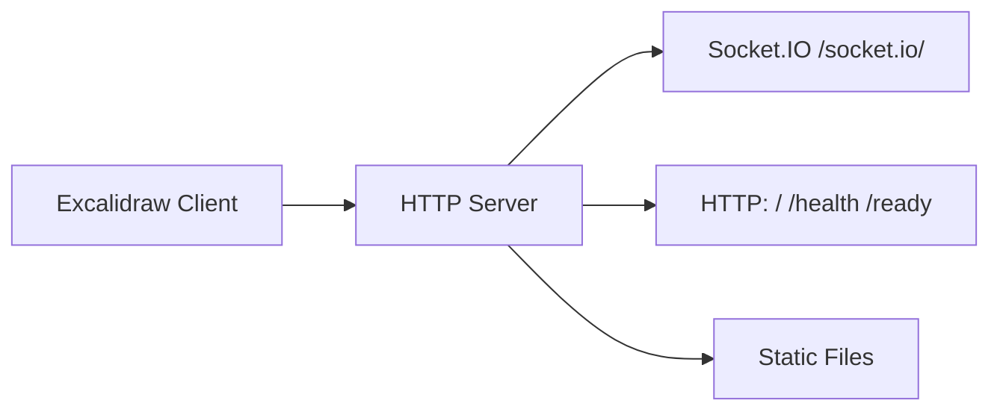

# Excalidraw Collaboration Server (Go)

A lightweight collaboration server for Excalidraw, compatible with the original
`excalidraw-room` Socket.IO protocol.



## Run

```sh
go run ./cmd/server
```

The server listens on `:8080` by default.

## Configuration

| Environment variable | Default | Description |
| --- | --- | --- |
| `PORT` | `8080` | HTTP port (1–65535) |
| `CORS_ORIGIN` | `*` | Allowed Socket.IO origin |
| `PUBLIC_DIR` | `public` | Static asset directory |
| `MAX_HTTP_BUFFER_SIZE` | `5242880` | Max bytes per Socket.IO message (5MB; raise for very large scenes) |

Use `.env.example` as a configuration reference.

## Endpoints

| Method | Path | Description |
| --- | --- | --- |
| `GET` | `/` | Service status text |
| `GET` | `/health` | Liveness probe |
| `GET` | `/ready` | Readiness probe |
| `GET` | `/*` | Files in `PUBLIC_DIR` |
| Socket.IO | `/socket.io/` | Excalidraw realtime collaboration |

## Development

```sh
make test
make vet
make build
```

Docker:

```sh
docker build -t excalidraw-room-go .
docker run --rm -p 8080:8080 excalidraw-room-go
```

## Release

Versions are managed with git tags (`vX.Y.Z`, semver); build and version
tooling comes from the shared [makefile-go](https://github.com/alswl/makefile-go)
toolkit (semtag + [git-cliff](https://git-cliff.org)), driven by
[Conventional Commits](https://www.conventionalcommits.org) (`feat:` minor,
`fix:` patch, `feat!:` major).

```sh
make version                                       # show current version (from VERSION)
make docker-build VERSION=v0.1.0                   # build a locally tagged image
make bump STAGE=final SCOPE=minor DRY_RUN=true     # preview next version
make bump STAGE=final SCOPE=minor DRY_RUN=false    # bump + changelog + tag
```

`make bump` writes the next version to `VERSION`, regenerates `CHANGELOG.md`
via git-cliff, commits and tags (`vX.Y.Z`). Pushing that tag automatically
publishes the image `alswl/excalidraw-room-go:<tag>` (plus `:latest`) through
the **Publish Docker** workflow, which reads the version straight from the tag.
See `specs/docs/build-and-publish.md` for the full flow.
