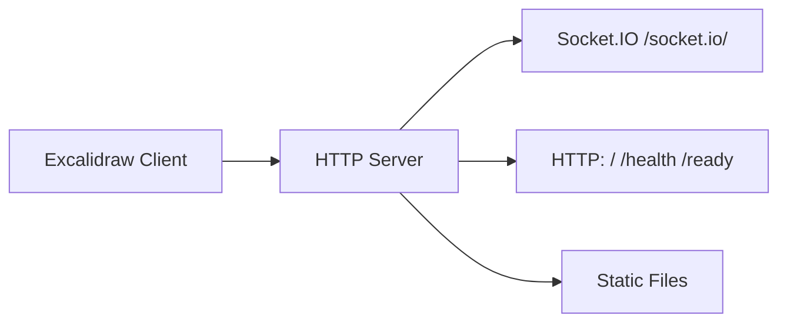

# Excalidraw Collaboration Server (Go)

[excalidraw-room](https://github.com/excalidraw/excalidraw-room) is Excalidraw's
official collaboration server (Node.js/Socket.IO, a reference example) that
enables real-time multi-user drawing. This project reimplements it in Go as a
single static binary — same `excalidraw-room` Socket.IO protocol, lighter and
easier to deploy.



## Run

```sh
go run ./cmd/server
```

The server listens on `:8080` by default.

## Configuration

| Environment variable | Default | Description |
| --- | --- | --- |
| `PORT` | `8080` | HTTP port (1–65535) |
| `CORS_ORIGIN` | `*` | Allowed Socket.IO origin |
| `PUBLIC_DIR` | `public` | Static asset directory |
| `MAX_HTTP_BUFFER_SIZE` | `5242880` | Max bytes per Socket.IO message (5MB; raise for very large scenes) |

Use `.env.example` as a configuration reference.

## Endpoints

| Method | Path | Description |
| --- | --- | --- |
| `GET` | `/` | Service status text |
| `GET` | `/health` | Liveness probe |
| `GET` | `/ready` | Readiness probe |
| `GET` | `/*` | Files in `PUBLIC_DIR` |
| Socket.IO | `/socket.io/` | Excalidraw realtime collaboration |

## Development

```sh
make test
make vet
make build
```

Docker:

```sh
docker build -t excalidraw-room-go .
docker run --rm -p 8080:8080 excalidraw-room-go

# Pre-built image on Docker Hub: https://hub.docker.com/r/alswl/excalidraw-room-go
docker run --rm -p 8080:8080 alswl/excalidraw-room-go:latest
```
